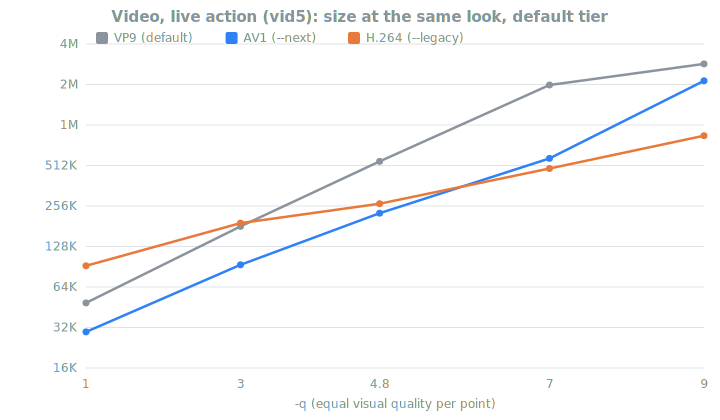
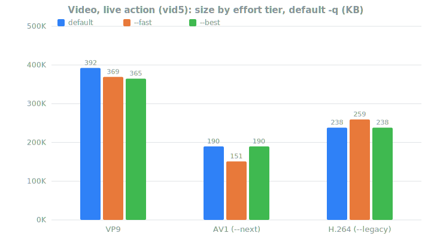
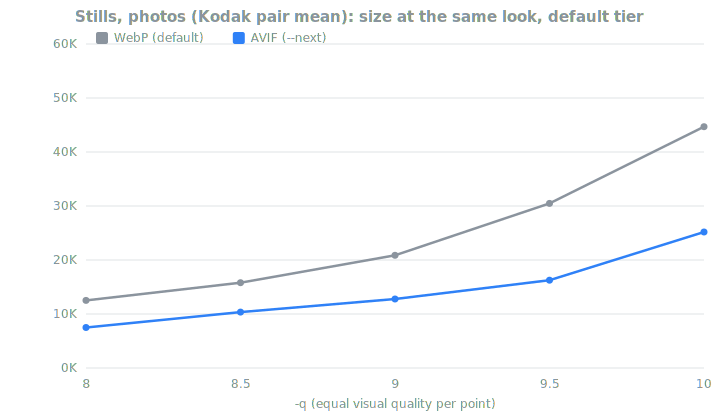
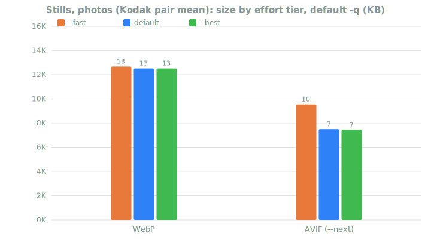
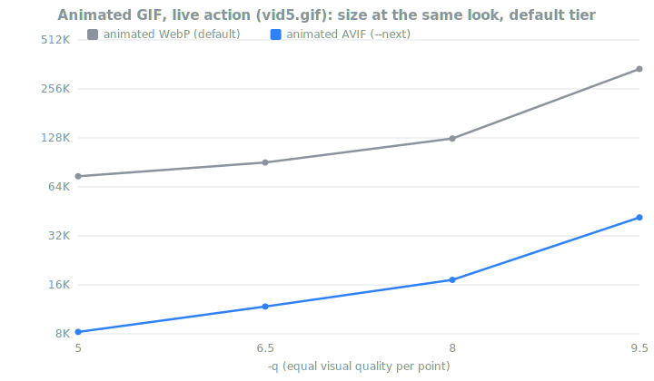
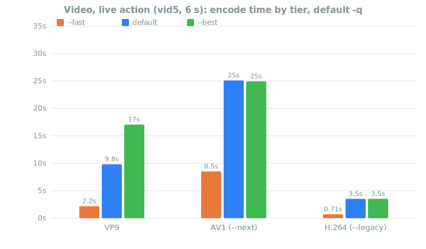
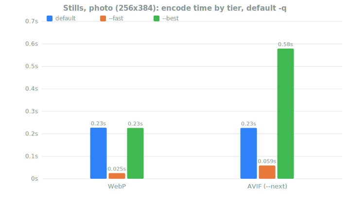
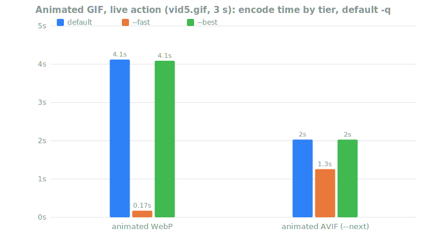

# Size at the same look — charts

Every `-q` mapping in webify is an equal-SSIM fit: at any given `-q`, all
three pipelines (default VP9/WebP, `--next` AV1/AVIF, `--legacy`
H.264/PNG) target the **same visual quality**, so file size is the only
axis left to compare — that is what these charts show. All data comes
from the calibration harness's real-content fixtures (`calibrate.sh`,
method in [next-calibration.md](next-calibration.md) /
[legacy-calibration.md](legacy-calibration.md)): the live-action
Tears of Steel clip for video and animation, the Kodak photo pair for
stills. The synthetic fixtures spread much wider — their numbers live in
the calibration docs' tables.

Regenerate after a re-calibration with:

    DIR=/tmp/webify-calib SQS="def 8.5 9 9.5 10" AQS="def 5 6.5 9.5" \
        ./calibrate.sh all                           # sizes (parallel, cached)
    python3 doc/graphs.py --bench /tmp/webify-calib  # encode times (serial!)
    python3 doc/graphs.py /tmp/webify-calib/results.csv

(The SQS/AQS knobs add the line charts' still and animation `-q` points
beyond the harness defaults; the video grid is covered by the default QS.)

The bench step runs strictly serially on an idle box — wall times from
the harness's 16-way encode pool would be contention noise, so sizes and
times are measured separately from the same fixtures and settings.

## Video

AV1 is the cheapest through the whole practical range (−25…−60% vs VP9).
H.264's flat CRF scale shows at both extremes: below `-q 3` its CRF mode
has no average cap, so the converted caps stop binding and it overshoots
VP9's size (the documented low-`-q` extreme), while at the top of the
scale x264-veryslow gets relatively cheaper and lands smallest on this
clip — maximum compatibility costs mostly encode time, not bytes. The
no-flag default sits just below `-q 4.8` (it targets VP9 CRF 36 vs 33).

The effort tiers barely move the *size* at the default `-q` — they trade
encode time (fast ≈ 4–15x faster, best a few % smaller) at the same
look. The AV1 fast outlier is real: single-pass cpu-used 6 with the +4
CRF tier offset lands visibly under the two-pass default's size because
the fast tier only promises the (lower) VP9-fast look.

## Still images

AVIF holds roughly −25…−45% under WebP on photographic content across
the upper `-q` range; the gap narrows toward `-q 10` where cwebp's
premium top end buys disproportionate quality and the AVIF CRF has to
dive to keep up. (Sharp graphics at high `-q` are the exception — WebP's
lossless race wins there; see [next.md](next.md).)

The two fast tiers pay for their speed in different currencies: cwebp's
`-m 4` costs a few percent more bytes at the same quality, while AVIF's
faster search drops real photographic detail and ships its `--fast` with
the CRF 4 lower instead — same look, ~25% more bytes than the default
AVIF, still well under WebP.

## Animated GIF

The biggest gap in the product: animated WebP re-codes every changed
region as an independent intra still, while AV1 inter-predicts motion
away — live action lands at 0.11–0.15x (−85…−89%) at the same look
across the `-q` range. The curve is anchored on this content class on
purpose; graphics/synthetic animations ride *above* parity at sizes that
stay below ~0.27x of animated WebP (see
[next-calibration.md](next-calibration.md)).

## Encoding time

Same fixtures, same settings, measured serially on an idle box (gateway:
x86_64, 16 cores — absolute numbers shift with the host, the *ratios*
are the point).

The size wins above are bought with encode time: AV1's default two-pass
runs ~2.6x the VP9 default (~4x realtime on this 6 s clip), and `--best`
≡ the default for AV1 — its deeper speeds measured *bigger* files, so
only VP9 spends extra time there (cpu-used 0 + arnr). H.264 is the
other direction: maximum compatibility at a *tenth* of the VP9 default's
time — veryslow already is its `--best` (placebo was rejected), and
preset fast lands under a second.

Stills are interchangeable at the default (~0.23 s each at this size) —
AVIF's `--fast` pays its 2x-vs-WebP time for holding photographic
quality (the −4 CRF offset digs more than a shallower search saves),
and its `--best` triples the default for the last −1-3% bytes.

Animated AVIF is *faster* than animated WebP at the default tier on top
of being ~7x smaller — inter prediction beats re-coding every frame on
both axes. Only the fast tiers differ in kind: libwebp's `-m 4` is
near-instant while libaom's cpu-used 6 still does real motion search.
